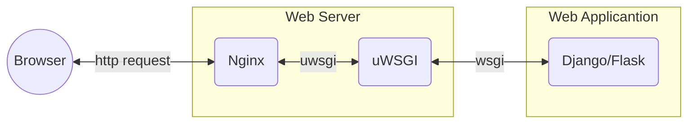
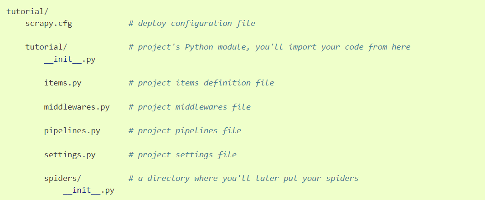
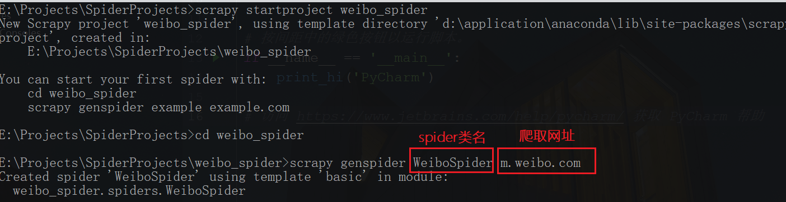
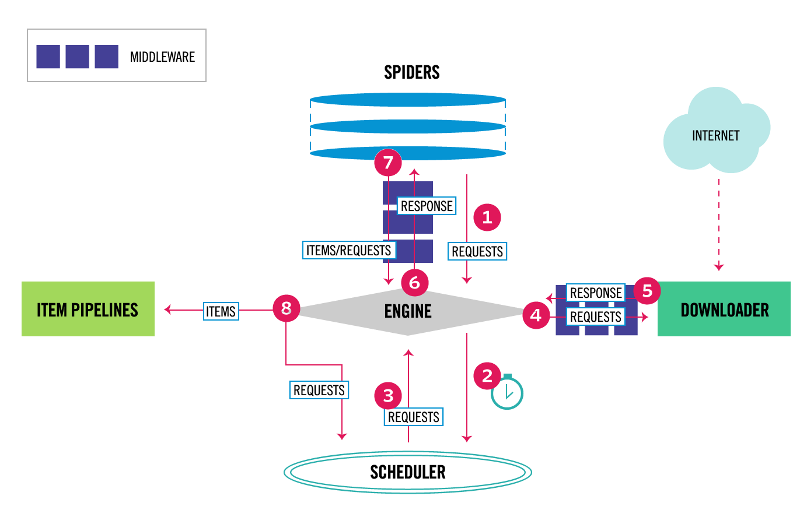
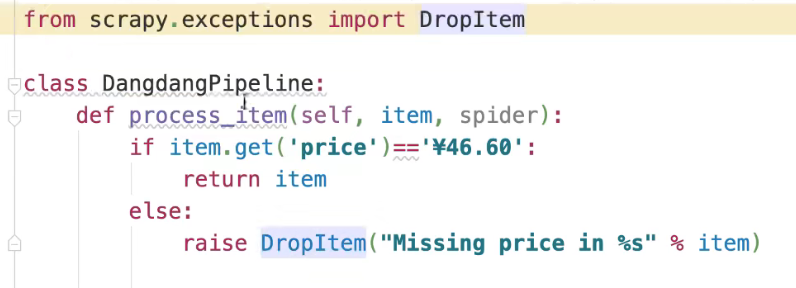
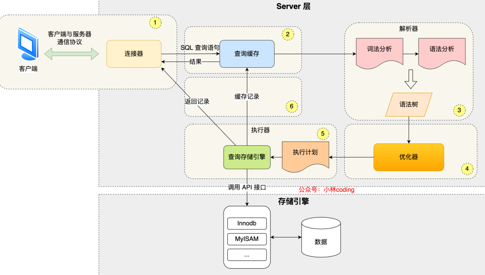

## Anconda环境


> **jupyter后台运行：**
>
> nohup jupyter notebook --allow-root > jupyter.log 2>&1 &
>
> **conda常用命令（windows环境）：**
>
> - conda create -n ENV_NAME python=x.x  创建环境
>- conda activate ENV_NAME  切换环境
> - conda env remove -n ENV_NAME  删除环境
>- conda env list  查看所有环境
> - conda deactivate 退出当前环境
>- conda config --show  查看conda配置
> 
>**主题设置**
> 
>字号12 cell屏幕宽占比90% -T显示工具栏
> 
> jt -t oceans16  -T -f fira -fs 12 -cellw 90%


## 基础

### 深浅拷贝

- 都会生成一个新对象，深拷贝的新对象地址和源对象不同
- 若为嵌套可变类型，浅拷贝只会拷贝最外层，里面为引用；深拷贝拷贝全新对象
- 若为嵌套不可变，深浅拷贝只会拷贝最外层，里面为引用

### 迭代器、生成器

`迭代器和可迭代对象的区别？`

​	迭代器实现了__iter__ 和__next__方法，可迭代对象实现了__iter__方法。迭代器一定是可迭代对象

yield from + 可迭代对象，实现对可迭代对象的再一次yield


### 类与对象

```python
class student():
    # 类变量，可在所有实例共享
    age = 20
    name = 'qiuwen'
    
    def __init__(self,age,name):
        # 实例变量，每个实例独有的
        self.age = age
        self.name = name

```

#### 继承多态

```python
class Student:
    def __init__(self, id, name, age, sex):
        self.id = id
        self.name = name
        self.age = age
        self.sex = sex
    def test(self):
        print("name:{} age:{} sex:{}".format(self.name, self.age,self.sex))

class BoyStudent(Student):
    def test(self):
        super().test()  # super：子类重写父类方法后还需调用父类方法
        print('男学生方法')
class GirlStudent(Student):
    def __init__(self, id, name, age, sex, grade):
        super().__init__(id, name, age, sex)
        self.grade = grade
    def test(self):
        print('女学生方法'+ self.grade)
        
        
s = Student(1, 'yuqiuwen', '20', 'male')
s.test()
bs = BoyStudent(1, 'yuqiuwen', '20', 'male')
bs.test()
gs = GirlStudent(2, 'zhongxin', '18', 'female','3')
gs.test()
    
```


> 多态：一个类有不同的子类，不同的子类实例化后的对象调用相同的接口有有不同的行为
>


**with实现**

```python
class MyClass:
    def __init__(self, filename, mode='r', encoding='utf-8'):
        self.filename = filename
        self.mode = mode
        self.encoding = encoding

    def __enter__(self):
        self.file = open(self.filename, mode=self.mode, encoding=self.encoding)
        return self.file
    
    def __exit__(self, exc_type, exc_val, exc_tb):
        self.file.close()


with MyClass('test.txt', 'w', encoding='utf-8') as f:
    f.write("test msg")
```

#### 魔法方法

cls是类本身，self是实例化后的对象

```python
__new__(cls)：构造方法，创建实例时首先调用的方法
__init__(self)：初始化方法，new方法返回对象后进行属性初始化
__del__(self)：析构方法，实例化对象被彻底销毁时调用
__len__(self)：被len()调用时的操作
__bool__(self)：被bool()调用时的行为
__str__(self)：被str()调用时的操作，将值转化为适于人阅读的形式
__repr__(self)：repr()调用时的操作，将值转化为供解释器读取的形式
__getattr__(self,name)：获取一个不存在的属性时的行为
__setattr__(self,name,value)：当一个属性被设置时的行为
__getattribute__(self,name)：当该类的属性被访问时首先调用的方法，可作为属性访问拦截器
__setitem__(self, key, value)：同setattr方法类似，区别在于如果将对象当作字典操作，设置键值对时会触发该方法
__call__(self)：允许将类实例当做函数调用
```

#### 内置属性

```python
__dict__：包含一个字典，由类的数据属性组成
__doc__：类的文档字符串
__name__：类名
__module__：类定义所在的模块
__bases__：类的所有父类构成元素
```

#### 元类（Metaclass）

`如何理解元类`

> [Python 元类详解 - Mr-Yang` - 博客园 (cnblogs.com)](https://www.cnblogs.com/XiaoYang-sir/archive/2022/07/27/16524775.html)
>
> [Python进阶灵魂拷问，元类是什么，它有什么用？ - ludongguoa - 博客园 (cnblogs.com)](https://www.cnblogs.com/ludongguoa/p/15350348.html)

元类实例化 ——>自定义class ——>自定义类实例化 ——>实例


#### 抽象类

`如何理解抽象类`

如果类是基于现实对象抽象而来，那么抽象类就是基于类抽象而来

`和普通类的区别`

- 抽象类不能被实例化，只能被继承
- 类中只能有抽象方法，没有具体功能实现
- 子类必须实现抽象方法


```python
import abc

class All_file(metaclass=abc.ABCMeta):
    all_type='file'
    
    @abc.abstractmethod #定义抽象方法，无需实现功能
    def read(self):
        '子类必须定义读功能'
        pass

    @abc.abstractmethod #定义抽象方法，无需实现功能
    def write(self):
        '子类必须定义写功能'
        pass
    
class Txt(All_file): #子类继承抽象类，但是必须定义read和write方法
    def read(self):
        print('文本数据的读取方法')

    def write(self):
        print('文本数据的读取方法')

class Sata(All_file): #子类继承抽象类，但是必须定义read和write方法
    def read(self):
        print('硬盘数据的读取方法')

    def write(self):
        print('硬盘数据的读取方法')
```


### 垃圾回收机制

1. `引用计数`

   增加引用计数：对象被创建或者将其引用赋值，引用计数就被设置为1

   1. 对象被创建
   2. 另外的别名被创建
   3. 被作为参数传递给函数
   4. 成为容器对象的第一个元素

   减少引用计数：当对象的引用被销毁时，引用计数就会减少

   1. 本地引用离开了作用范围
   2. 对象的别名被显示销毁
   3. 对象的一个别名被赋值给其他对象
   4. 对象被从一个窗口对象中移除
   5. 窗口对象本身被销毁

2. `标记-清除`

   解决循环引用的问题。如a=1,b=2,执行a=b时将进行标记清除

3. `分代回收`

   基于引用计数的回收机制，每次回收内存，都需要把所有对象的引用计数都遍历一遍，这是非常消耗时间的，于是引入了分代回收来提高回收效率，分代回收采用的是用“空间换时间”的策略。在历经多次扫描的情况下，都没有被回收的变量，gc机制就会认为，该变量是常用变量，gc对其扫描的频率会降低


### socket

```python
from socket import *


"""客户端"""

IP = '127.0.0.1'
SERVER_PORT = 8006
BUFLEN = 1024

dataSocket = socket(AF_INET, SOCK_STREAM)

# 连接服务端
dataSocket.connect((IP, SERVER_PORT))

while True:
    toSend = input('>> ')
    if toSend == '':
        break
    dataSocket.send(toSend.encode())

    recved = dataSocket.recv(BUFLEN)
    if not recved:
        break

    print(recved.decode())

dataSocket.close()
```


```python
from socket import *


"""
服务端
"""

IP = '127.0.0.1'
PORT = 8006
BUFLEN = 1024    # 一次从socket缓冲区最多读入512个字节数据


"""
实例化一个socket对象
AF_INET表示该socket网络层使用ip协议
SOCK_STREAM 表示socket传输层使用tcp协议
"""
listenSocket = socket(AF_INET, SOCK_STREAM)

# socket绑定地址和端口
listenSocket.bind((IP, PORT))

# 使socket处于监听状态，等待客户端的连接请求
# 5表示最多接受5个等待连接的客户端
listenSocket.listen(5)
print(f"服务端启动成功，在{PORT}端口等待客户端连接...")

dataSocket, addr = listenSocket.accept()
print("接收一个客户端连接：", addr)

while True:
    # 读取对方发送的信息，最多读取BUFLEN字节
    recved = dataSocket.recv(BUFLEN)

    # 返回空字节，表示对方关闭了连接
    if not recved:
        break

    info = recved.decode()
    print(f"收到对方信息：{info}")

    dataSocket.send(f"服务端接收到了信息：{info}".encode())

dataSocket.close()
listenSocket.close()
```


### 装饰器

#### 有参装饰

```python
def timeit(max_time):
    def inner(f):
        def wrapper(*args, **kw):
            start = time.perf_counter()
            res = f(*args, **kw)
            end = time.perf_counter()
            execute_time = end - start
            if execute_time > max_time:
                print(f""""func" function exceeds max_time""")
            else:
                print(f""""func" function ran for {execute_time}""")
            return res
        return wrapper
    return inner


@timeit(max_time=1)
def func(*args, **kw):
    time.sleep(2)

func(1)

"""相当于执行func = timeit(1)(func)，即先执行timeit(1)返回一个inner函数的引用，然后将func传给inner函数，返回wrapper保存到func对象"""
```

#### 无参装饰

```python
def timeit(f):
    # 这里使用*args和**kwargs使得函数可传递变长参数
    def wrapper(*args, **kwargs):
        start = time.perf_counter()
        f(*args, **kw)
        end = time.perf_counter()
        execute_time = end - start
        if execute_time > 2:
            print(f""""func" function exceeds max_time""")
        else:
            print(f""""func" function ran for {execute_time}""")
    return wrapper
    
@timeit
def func(*args, **kw):
    time.sleep(2)
    
"""相当于执行func = timeit(func)"""
```


#### 类装饰器

**无参**

```python

class Timer:
    def __init__(self, func):
        self.func = func
    
    def __call__(self, *args, **kwargs):
        start = time.perf_counter()
        ret = self.func(*args, **kwargs)
        end = time.perf_counter()
        execute_time = end - start
        if execute_time > 2:
            print(f""""func" function exceeds max_time""")
        else:
            print(f""""func" function ran for {execute_time}""")
        return ret
        
@Timer
def func(*args, **kw):
    time.sleep(2)
    
"""相当于执行func=Timer(func)"""
```

**有参**


​    
```python
class Timer:
    def __init__(self, max_time):
        self.max_time = max_time
        
    def __call__(self, func):
        def wrapper(*args, **kwargs):
            start = time.perf_counter()
            ret = func(*args, **kwargs)
            end = time.perf_counter()
            execute_time = end - start
            if execute_time > 2:
                print(f""""func" function exceeds max_time""")
            else:
                print(f""""func" function ran for {execute_time}""")
        	return ret
       	return wrapper
    
@Timer(max_time=2)
def func(*args, **kw):
    time.sleep(2)
    
"""相当于执行func=Timer(max_time=2)(func)"""
```


### GIL

全局解释器锁，遇到IO操作时，强制释放GIL锁，使得任何时刻仅有一个线程在执行，可以解决多线程之间数据完整性和状态同步问题，简化对共享资源的管理


### 并发编程

> - 进程是资源分配的单位，线程是操作系统调度的基本单元
> - 进程的创建、销毁和切换较线程开销更大。因为系统运行时会为每个进程分配独立的内存空间，而线程不会分配，线程之间共享同一进程下的资源
> - 一个进程中至少有一个线程
> - 协程存在于某一个线程中，可以控制该线程中的几个函数交替执行（io阻塞时进行切换）


#### 多线程

##### 守护线程

> 所谓“守护线程”就是在主线程结束的时候，不值得再保留的执行线程。这里的不值得保留指的是守护线程会在其他非守护线程全部运行结束之后被销毁，它守护的是当前进程内所有的非守护线程。简单的说，守护线程会跟随主线程一起挂掉，而主线程的生命周期就是一个进程的生命周期。如果不理解，我们可以看一段简单的代码。

将名为`daemon`的参数设置为`True`，这两个线程就会变成守护线程，那么在其他线程结束时，即便有死循环，两个守护线程也会挂掉，不会再继续执行下去，代码如下所示。

 ```python
import time
from threading import Thread


def display(content):
    while True:
        print(content, end='', flush=True)
        time.sleep(0.1)


def main():
    Thread(target=display, args=('Ping', ), daemon=True).start()
    Thread(target=display, args=('Pong', ), daemon=True).start()
    time.sleep(5)


if __name__ == '__main__':
    main()
 ```

上面的代码，我们在主线程中添加了一行`time.sleep(5)`让主线程休眠5秒，在这个过程中，输出`Ping`和`Pong`的守护线程会持续运转，直到主线程在5秒后结束，这两个守护线程也被销毁，不再继续运行。

##### 锁

> RLock：重入锁，可以被同一个线程多次acquire，调用相同次数的release才可完全释放锁；在线程A中创建则只能在线程A中释放
>
> Lock：同一线程中只能被acquire一次；可以在线程A中创建，线程B中释放


```python
import time

from concurrent.futures import ThreadPoolExecutor
from threading import RLock


class Account(object):
    """银行账户"""
    def __init__(self):
        self.balance = 0.0
        self.lock = RLock()

    def deposit(self, money):
        # 通过上下文语法获得锁和释放锁
        with self.lock:
            new_balance = self.balance + money
            time.sleep(0.01)
            self.balance = new_balance
            
def main():
    """主函数"""
    account = Account()
    with ThreadPoolExecutor(max_workers=16) as pool:
        for _ in range(100):
            pool.submit(account.deposit, 1)
            print(account.balance)

if __name__ == '__main__':
    main()
```


`打印0与奇偶数：`

```python
class ZeroEvenOdd:
    def __init__(self, n):
        self.n = n
        self.lock_zero = threading.Lock()
        self.lock_even = threading.Lock()
        self.lock_odd = threading.Lock()
		
        # 初始锁住奇偶，保证先输出0
        self.lock_even.acquire()
        self.lock_odd.acquire()

    def zero(self) -> None:
        for i in range(1, self.n + 1):
            self.lock_zero.acquire()
            print(0, end="")
            # 上次输出偶数，则此次释放奇数锁，使下次输出奇数
            if i & 1 == 0:
                self.lock_even.release()
            else:
                self.lock_odd.release()

    # 偶数
    def even(self) -> None:
        for i in range(2, self.n+1, 2):
            self.lock_even.acquire()
            print(i, end="")
            self.lock_zero.release()
	
    # 奇数
    def odd(self) -> None:
        for i in range(1, self.n + 1, 2):
            self.lock_odd.acquire()
            print(i, end="")
            self.lock_zero.release()
```


:::tip 死锁

线程A获取了1号锁，等待释放2号锁；线程B获取了2号锁，等待释放1号锁

:::


##### 队列

```python
"""启用两个线程实现交替打印foobar"""

class FooBar:
    def __init__(self, n):
        self.n = n
        self.queue_bar = Queue()
        self.queue_foo = Queue()
        self.queue_foo.put('')	# 初始foo队列放入一个元素保证首先输出foo

    def foo(self):


        for i in range(self.n):     
            self.queue_foo.get()	# 默认阻塞，队列为空时会一直阻塞
            print("foo", end="")
            self.queue_bar.put('')	# 默认会阻塞直至队列有空位

    def bar(self):

        for i in range(self.n):
            self.queue_bar.get()
            print("bar", end="")
            self.queue_foo.put('')


if __name__ == "__main__":
    n = int(input())
    c = FooBar(n)
    foo = threading.Thread(target=c.foo, name='thread_foo')
    bar = threading.Thread(target=c.bar, name='thread_bar')

    foo.start()
    bar.start()


```

##### 线程池

```python
from threading import RLock, Lock
from concurrent.futures import ThreadPoolExecutor, as_completed


class FooBar:
    def __init__(self, n):
        self.n = n
        self.queue_bar = Queue()
        self.queue_foo = Queue()
        self.queue_foo.put('')

    def foo(self):
        for i in range(self.n):
            # 默认阻塞，队列为空时会一直
            self.queue_foo.get()
            time.sleep(0.3)
            print("foo", end="")
            self.queue_bar.put('')

        return "print foo has completed"

    def bar(self):
        for i in range(self.n):
            # 队列为空时会阻塞
            self.queue_bar.get()
            time.sleep(0.3)
            print("bar", end="")
            self.queue_foo.put('')
        return "print bar has completed"


def print_threading():
    n = int(input())
    c = FooBar(n)
    target = [c.foo, c.bar]
    futures = []
    with ThreadPoolExecutor(max_workers=2) as pool:
        futures = [pool.submit(i) for i in target]
        
        # 获取返回结果，as_completed不用等待所有任务完成即可返回结果
        for f in as_completed(futures):
            data = f.result()
            print(data)

"""
timeit库的用法
	stmt:传入要测试的代码或函数
	setip:运行时的变量、模块等，多行语句用;隔开
	number:运行次数，默认100万次
"""
execute_time = timeit.timeit(stmt='print_threading()', setup='from __main__ import print_threading', number=1,)
print(execute_time)
```


#### 协程

> 单线程完成多任务，多个任务按照一定顺序交替执行


`python3.7之前的版本`

```python
import asyncio


async def task1(x):
    print("task1开始")
    # 执行到await时任务被挂起，跳到下一个任务
    await asyncio.sleep(1)
    print("task1完成")
    return x ** 2


async def task2(y):
    print("task2开始")
    await asyncio.sleep(2)
    print("task2完成")
    return y ** 2


async def main():
    # 协程对象，该对象不能直接运行
    coroutine1 = task1(2)
    coroutine2 = task2(3)
    await asyncio.gather(coroutine1, coroutine2)

    
# python3.7版本及之后实现协程
asyncio.run(main())

# python3.7之前
# # 事件循环对象
# loop = asyncio.get_event_loop()
# # 将协程对象注册到事件循环中，并执行
# ret = loop.run_until_complete(coroutine1)
# print(ret)

```


#### 如何选择？

- CPU Bound => Multi Processing
- I/O Bound, Fast I/O, Limited Number of Connections => Multi Threading
- I/O Bound, Slow I/O, Many connections => Asyncio


### 常用库

#### pathlib2

```python
path1 = r"E:\Projects\PythonProjects\flask\test.py"
path2 = Path(r"E:\Projects\PythonProjects\flask\test.py")

# 当前目录
print(Path.cwd())
print(os.getcwd())

# 家目录
print(Path.home())

# 绝对路径
print(os.path.abspath("目标绝对路径"))
print(os.path.realpath("返回软链接的源地址"))
print(path2.resolve())
print(os.path.isabs(path1))
print(path2.is_absolute())

# 相对路径
Path("/etc/passwd").relative_to("/etc")     # passwd
os.path.relpath("/etc/passwd", start=os.curdir)

# 文件名
print(os.path.basename(path1))
print(path2.name)

# 目录名
print(os.path.dirname(path1))
print(path2.parent)

# 判断文件是否存在
print(os.path.isfile(path1))
print(path2.is_file())

# 判断目录是否存在
print(os.path.isdir(path1))
print(path2.is_dir())

# 判断路径是否存在
print(os.path.exists(path1))
print(path2.exists())

# 路径拼接
print(os.path.join("path1", "path2"))	# 若path2也为绝对路径，则返回path2的路径
print(path2.joinpath(path3))
print(Path(path2, 'path3', 'file.py'))
print(path2/'file.py')

# 路径分割
print(os.path.split("/a/b/c.py.go"))		# ('/a/b', 'c.py')
print(os.path.splitext("/a/b/c.py.go"))		# ('/a/b/c.py', '.go')
print(Path("/a/b/c.py.go").suffix)			# ['.go']
print(Path("/a/b/c.py.go").suffixes)		# ['.py', '.go']
print(Path("/a/b/c.py.go").stem)			# c.py

# 路径比较
os.path.commonpath(['/usr/lib', '/usr/local/lib'])  # '/usr'
os.path.commonprefix(['/usr/lib', '/usr/local/lib'])  # '/usr/l'

# 替换用户家目录,~会被替换为系统当前的用户名
os.path.expanduser("~/test.py")  # /{user}/test.py
Path("~/test.py").expanduser()   # /{user}/test.py

# 替换windows反斜杠
path2.as_posix()

# 路径模式匹配，若pattern是绝对路径，path也必须为绝对路径
path2.match('/*.py')

# 创建
os.mkdir("创建目录")
os.makedirs("支持多级创建", exist_ok=True)   # exist_ok=True 存在就不创建
Path("path").mkdir(exist_ok=True, parents=True)  # parents=True 多级创建
Path("在指定路径创建文件").touch()

# 删除，删除的目录必须是空目录，否则会报错
os.remove("只能是删除文件")
os.rmdir("删除目录")
os.removedirs("可以删除多级目录")
Path("删除目录").rmdir()
Path("删除文件，若路径是目录，则删除目录").unlink()

# 重命名
os.rename("旧文件名", "新文件名")
os.renames("旧路径", "新路径")        # rename的扩展，还可以重命名路径（目录名）
Path("旧路径").rename("新路径")       # 只能重命名文件，无法重命名路径
Path("c:/Downloads/pathlib.tar.gz").with_name("setup.py")   # c:/Downloads/setup.py
Path("c:/Downloads/pathlib.tar.gz").with_suffix(".bz2")     # c:/Downloads/pathlib.tar.bz2

Path("返回文件信息").stat()
with path2.open() as f:
    ...

# 遍历目录
for root, dirs, files in os.walk("深度遍历", followlinks=False):
# root-目录路径，dirs-当前路径下的所有目录名，files当前目录下的所有文件名
	for filename in files:
		file_path = os.path.join(root, filename)
            yield file_path
            
files = [path for path in os.listdir("只遍历一级的目录和文件")]
files = [path for path in Path("返回生成器, 只遍历一级目录和文件").iterdir()]
files = [path for path in Path("返回生成器, 只遍历一级目录和文件，可正则过滤").glob('*.txt')]
files = [path for path in Path("返回生成器, 深度遍历，[!.]会排除以点开头的文件").rglob('[!.]*')]
```


## 设计模式

### 单例模式


`装饰器形式`

```python
from functools import wraps
from threading import RLock


def singleton(cls):
    """线程安全的单例装饰器"""
    instances = {}
    lock = RLock()
	
    # 使用wraps可保证不会修改被装饰函数的结构，如name等
    @wraps(cls)
    def wrapper(*args, **kwargs):
         
        """
        判断是否已有实例,如无,则新建一个实例并返回;
        先做不带锁的判断，再做带锁的检查，因为如果对象已经创建就没必要加锁可直接返回；第二个if是因为多个线程抢占锁，若第一个线程创建了实例，那么下一个线程进入就需要再判断一次
        instance = {<class '__main__.Single'>: <__main__.Single object at 0x000001A96F26FE20>}
        """
        if cls not in instances:
            with lock:
                if cls not in instances:
                    instances[cls] = cls(*args, **kwargs)
        return instances[cls]
    
   	return wrapper
```


`单例类`

```python
class Singleton:
    instance = None
    lock = threading.RLock()
    
    def __init__(self, *args, **kwargs):
        pass
    
    def __new__(cls, *args, **kwargs):
        # 返回空对象
        if not cls.instance:
            with cls.lock:
                if not cls.instance:
                    cls.instance = object.__new__(cls)
        return cls.instance
```


## xpath

[ xPath 用法总结整理_疯狂哈丘的博客-CSDN博客_xpath语法](https://blog.csdn.net/u013332124/article/details/80621638)

| 符号                          | 含义                        |
| ----------------------------- | --------------------------- |
| /                             | 从当前节点选取直接子节点    |
| //                            | 从当前节点选取子孙节点      |
| .                             | 选取当前节点                |
| ..                            | 选取当前节点的父节点        |
| @                             | 选取属性                    |
| //*[contains(@class,'item')]  | 提取所有class包含名为item的 |
| //*[starts-with(@class,'ul')] | 提取所有class开头为ul的     |


在获得目标节点同兄弟节点后

./following-sibling::兄弟标签名[1]　　下面一个兄弟节点

./following-sibling::*[N]　　　　下面N个性的节点

./preceding-sibling::兄弟标签名[1]　　　　上面一个兄弟节点

./following-sibling::*[N] 　　　上面N个性的节点


## Django

```python
创建项目  django-admin startproject keep_healthy
创建app	python manage.py startapp diabetes
后台启动  nohup python3 manage.py runserver 0.0.0.0:8082> /dev/null 2> /dev/null &
         nohup flask run -h 0.0.0.0 -p 5000 >/dev/null 2>&1 &
```


wsgi: 同步

asgi：wsgi+异步+websocket

**部署相关**

> runserver：开发调试时使用（单进程）
>
> wsgi：Web服务器网关接口，用于web服务器与python应用程序交互
>
> uwsgi：一种二进制线路协议，用于uWSGI服务器和其他网络服务器的通信
>
> uWSGI：实现了uwsgi和WSGI两种协议的Web服务器（默认单进程单线程）
>
> asgi: 基于wsgi接口规范之上的异步服务器网关接口规范




**生成requirements.txt依赖**

`pipreqs ./ --encoding=utf8`


## scrapy爬虫

### 项目创建

1. 创建项目scrapy startproject tutorial





`执行：`scrapy crawl WeiboSpider





### 中间件

开启中间件settings.py

```python
#SPIDER_MIDDLEWARES = {
#    'weibo_spider.middlewares.WeiboSpiderSpiderMiddleware': 543,
#}
```

### ITEM_PIPELINE

作用：清理html数据、验证去重、存储到数据库




### 反爬


1. User-Agent代理反爬（可通过fake-useragent库应对）
2. 验证码（暴力破解、机器学习建模、selenium模拟）
3. 数据加密（css偏移、字体加密、js跳转）
4. 字体反爬


## 脚本开发


打包成可执行文件（推荐使用虚拟环境，连同模块一起打包，使得脚本能在任何机器上执行而不用再安装环境）：

pyinstaller -F 脚本文件路径


## 正则表达式


1. 只能输入汉字、英文、数字和下划线	^[\w\u4e00-\u9fa5]+$


####  匹配词中的字符

```python
s1 = 'bar ber bir bor bur'
s2 = 'abecdfghijklmnopqrstuvwxyz'
regex = ["b[ieo]r","b[^ieo]r","[e-o]"]
re.findall(regex[0],string=s1)  # ['ber', 'bir', 'bor']
re.findall(regex[1],string=s1) # ['bar', 'bur']
re.findall(regex[2],string=s2) # 匹配字符范围，数字同理
```


#### 量词

```python
* 不出现、出现一次或多次（贪婪匹配）

s = 'br ber beer beeer'
re.findall("be*r", string=s)

+ 出现一次或多次

re.findall("be+r", string=s)

? 可选字符(懒惰匹配)

re.findall("be?r", string=s) # ['br', 'ber']

{} 出现次数

re.findall("be{1}r", string=s)  # 出现一次
re.findall("be{1,}r", string=s)  # 至少出现一次
re.findall("be{1,3}r", string=s)  # 出现1~3次
```


#### 组

```python
()

s="ha-ha,haa-haa"

re.findall(r"(ha)-\1,(haa)-\2",string=s)  # \1引用分组
re.findall(r"(?:ha)-ha,(haa)-\1",string=s)  # (?:)非引用分组

| 或

s = 'cat Cat rat'
re.findall(r"(C|c)at|rat", string=s)

^ $行首 行尾

s = '1. 3 eggs, beaten3'
re.findall('^[0-9]', string=s)
re.findall('[0-9]$', string=s)


```


#### 字符
- \w  字母、数字、下划线
- \w  除字母、数字和下划线之外的字符
- \d  数字
- \D 除数字之外的字符
- \s 仅匹配空白字符
- \S 匹配除空白符之外的字符

#### 零宽断言

```python
s = 'Date: 4 Aug 3PM'

正向先行断言: (?=)
#只匹配后面有PM的数值
re.findall('\d+(?=PM)',string=s)


负向先行断言: (?!)
# 数字右边不是PM
re.findall('\d+(?!PM)',string=s)


正向后行断言: (?<=)
# 数字左边为$
s='Product Code: 1064 Price: $5'
re.findall("(?<=\$)\d+",string=s)


负向后行断言
# 数字左边不包含$
re.findall("(?<!\$)\d+",string=s)
```


#### 标志

```python
s = 'cAt cat cat'

regex = re.compile(r'cat', re.IGNORECASE)
re.findall(regex, string=s)


s = "42 11.1   -2.0  rng 24"
re.findall("(?:-?\d+\.?\d+\s+)+(?=rng)", s)
?: 意思是非捕获分组，可以取消分组功能，若有'()',findall默认会捕获括号分组，search默认捕获所有分组，
```


#### 案例

```python
import re

"""match ip"""

# 如47.98.97.198

1. 匹配0-255，包括0-199和200-255：([0-1]?\d{1,2})|(2((5[0-5])|([0-4]\d)))
2. ‘.XXX’匹配三次：(\.(([0-1]?\d{1,2})|(2((5[0-5])|([0-4]\d))))){3}

reg = re.compile("^(([0-1]?\d{1,2})|(2((5[0-5])|([0-4]\d))))(\.(([0-1]?\d{1,2})|(2((5[0-5])|([0-4]\d))))){3}$")


```


**vscode编辑器正则替换**


```
字符串：==先变换成洛必达法则适用形式==
保留双等号中间的字符串内容，替换为：

:::tip

 先变换成洛必达法则适用形式 

:::

查找：(==)(.*)(==)
替换：:::tip\n\n $2 \n\n:::
$2表示第二个变量
```


## 数据库


### MySQL

#### 增删改查

```mysql
# 插入
INSERT INTO 表名 (列名) VALUES (,,,)
# 删除
DELETE FROM 表名 WHERE 条件
TRUNCATE TABLE 表名
# 更新
UPDATE 表名 SET 列名1=值1,列名2=值2 WHERE
```


```mysql
#DISTINCT返回唯一不同的值
SELECT DISTINCT 列名称 FROM 表名称

#ORDER BY排序（DESC降序，ASC升序）
SELECT Company, OrderNumber FROM Orders ORDER BY Company DESC, OrderNumber ASC

# IFNULL如果第一个参数 为 NULL，则返回第二个参数的备用值
IFNULL(
       (SELECT DISTINCT Salary
       FROM Employee
       ORDER BY Salary DESC 
       LIMIT 2 OFFSET 1),	#返回从第三行开始，共1行数据
       NULL)
    )
    
#join内连接，和inner join效果一样
SELECT a.NAME AS Employee
FROM Employee AS a JOIN Employee AS b
     ON a.ManagerId = b.Id
     AND a.Salary > b.Salary
     
# Dense_RANK() over对成绩排名，RANK() over排名时若有并列将占用下一位的位置
select Score,Dense_RANK() over (order by Score desc) as `Rank`
from Scores
   
#顺序：where——group by——having，注意group by紧跟在where最后一个限制条件后面，不能被夹在where限制条件之间。使用了having必须使用group by，但是使用group by 不一定使用having

#IF(condition, value_if_true, value_if_false)

#回购率：某一个时间窗口内消费的用户，在下一个时间窗口仍旧消费的占比
 #复购率：在某时间窗口内重复消费用户（消费两次及以上的用户）在总消费用户中占比

```


#### 索引

> [数据库两大神器【索引和锁】 - 掘金 (juejin.cn)](https://juejin.cn/post/6844903645125820424)

##### B树


##### B+索引


**Mysql索引分类：**

- 唯一索引
- 主键索引
- 联合索引


**说明：**

1. 主键不能为null，唯一索引可以为null；主键可以做为外键，唯一索引不行
2. 经常用到where条件的字段，应该建立索引，如果where条件中是OR关系，加索引不起作用
3. 经常用到连接的列上创建索引
4. 创建联合索引应当把最常用的条件字段放在最左（`最左前缀原则`），如（age,name,sex）相当于创建了（age）（age，name）（age,name,sex）三个索引
5. 索引不会包含有NULL值的列

最左前缀原则如果遇到范围查询`(>、<、between、like`左匹配)等就不能进一步匹配了


**为什么能增加查询速度？**

索引底层是一棵B+树（叶节点存放数据，其余节点存放索引。所有叶子节点之间都有一个链指针），通过二分查找，找到对应目录的数据；如果不用索引，就要遍历双向链表


**为什么降低增删改速度？**

B+树是一棵平衡树（左右子树高度差的绝对值<=1），增删改会破坏原有树的结构，要重新调整平衡


**B树和B+树的区别？**

b+树叶节点存储数据，内部节点存储索引。查询效率较b树更稳定，因为每次查询都是从根节点到叶节点，而b树在内部某个节点查询到匹配值时就停止查找了。

同时b+树支持范围查询，叶节点之间通过指针连接，形成一个有序链表，通过遍历叶节点即可遍历整棵树

##### 哈希索引

直接根据哈希值定位

- 不支持最左匹配原则
- 在有大量重复键值的情况下，存在哈希碰撞可能
- 不支持范围查询


**如何处理哈希冲突？**

1. 开放定址
   - 线性探测。冲突发生时，顺序查看下一单元
   - 平方探测
   - 再散列
2. 拉链法

把所有同义词存放在一个线性链表中

#### 事务特性

- 原子性：事务不可分割，要么全部成功，要么全部失败
- 一致性：事务执行前后数据库保持一致性状态，若执行失败需要回滚
- 隔离性：多个事务之间互不干扰
- 持久性：事务开始就不会终止，不受其他因素影响

#### 隔离级别

- `READ UNCOMMITED`：读未提交，其他事务只要修改了数据，即使未提交，本事务也能看到修改后的数据值
- `READ COMMITED`：读已提交，其他事务提交了对数据的修改后，本事务就能读取到修改后的数据值 
- `REPEATABLE READ`：可重复读，无论其他事务是否修改并提交了数据，在这个事务中看到的数据值始终不受其他事务影响
- `Serializable`：串行化，一个事务一个事务的执行

#### 锁

按属性分：

- `共享锁（读锁）`：读的时候其他事务不支持修改操作
- `排他锁（写锁）`：在对数据进行修改的时候不允许其他事务读或写

按粒度分：

- `行锁（InnoDB）`：开销大，加锁慢，不易冲突
- `表锁（InnoDB、MyISAM）`：开销小，加锁快，易冲突

`乐观锁`：读某个字段，处理完业务逻辑开始更新之前，需要查看字段值是否变化，如果不一样则拒绝更新

`悲观锁`：数据库层面加锁，select语句之后加上for update

行锁表锁都是悲观锁；MyISAM不支持事务


死锁解决：

- 以固定的顺序访问表和行。比如对两个job批量更新的情形，简单方法是对id列表先排序，后执行，这样就避免了交叉等待锁的情形；将两个事务的sql顺序调整为一致，也能避免死锁。
- 大事务拆小。大事务更倾向于死锁，如果业务允许，将大事务拆小。
- 在同一个事务中，尽可能做到一次锁定所需要的所有资源，减少死锁概率。
- 降低隔离级别。如果业务允许，将隔离级别调低也是较好的选择，比如将隔离级别从RR调整为RC，可以避免掉很多因为gap锁造成的死锁。
- 为表添加合理的索引。可以看到如果不走索引将会为表的每一行记录添加上锁，死锁的概率大大增大。


#### 执行流程





#### 视图 触发器 游标

> 触发器：trigger，是指事先为某张表绑定一段代码，当表中的某些内容发生改变（增、删、改）的时候，系统会自动触发代码并执行。
>
> 游标：类似一个指针，可对结果集进行处理，它总是指向某一行来对其进行操作


#### 查询优化


1. 分库分表

   - 水平

     库和表的数据、结构都一样，无交集

   - 垂直

     - 分库：库结构、数据不一样，所有库的并集为全量数据
     - 分表：表结构、数据不一样，至少有一列交集用于关联数据，所有表的并集为全量数据

2. 字段避免null,可以使用0或其他数字代替null

3. 单表字段不要太多

4. [加索引](###索引)

5. SQL语句优化：limit、避免select *、小表 join 大表


#### 问题排查

```mysql
查看当前Mysql所有的进程,找到最耗时的进程
show processlist;

查看Mysql的最大缓存
show global variables like "global max_allowed_packet"

查看当前正在进行的事务
select * from information_schema.INNODB_TRX

查看当前Mysql的连接数
show status like 'thread%'

top查看服务器的CPU占用率
```


#### 设计规范

##### 密码字段

**账户密码存储设计**

动态盐+非固定加密算法

salt + cryption_algorithm + value

（每次注册产生的盐值+注册日期）+ 加密算法 + 加密后的字符串 

##### 时间字段

- 最好使用datetime，而不是timestamp（存在性能问题）

- 配置指定时区，而不是使用操作系统的时区，配置文件中设置参数time_zone='+08:00'
- 每张业务核心表都增加一个datetime类型的last_modify_date字段，并设置修改自动更新机制

##### 范式准则

- 1NF：字段具有原子性，不能再分
- 2NF：每行必须被唯一区分，每张表使用BIGINT类型作为主键
- 3NF：每列都和主键列直接相关，不存在传递依赖

##### 主键设计

自增主键

**核心业务表推荐使用UUID或业务自定义主键，非核心业务表可以用自增键做主键，原因如下：**

- 8.0版本之前自增存在回溯问题
- 自增值在服务器端产生，存在并发性能问题
- 自增值做主键，只能在当前实例中保证唯一，不能保证全局唯一
- 公开数据值，容易引发安全问题
- MGR（mysql group replication）可能引起的性能问题
- 分布式架构设计问题

UUID主键设计

UUID全局唯一

海量并发推荐使用UUID（分布式数据库）

```mysql
create table User (
	id BINARY(16) NOT NULL,
    uuid CHAR(36) AS (BIN_TO_UUID(id)),
    PRIMARY KEY(id)
);

# 插入
insert into User Values (UUID_TO_BIN(UUID(), True),......)
```


### MongoDB

```sql
# 删除集合中所有数据
use <database>
db.<collection>.deleteMany({})
```


## 计算机网络

#### http状态码

| 状态码 | 含义         | 举例                                                |
| ------ | ------------ | --------------------------------------------------- |
| 1xx    | 信息性状态码 |                                                     |
| 2xx    | 成功状态码   | 200请求成功                                         |
| 3xx    | 重定向       | 301永久重定向（url不可更改），302暂时重定向         |
| 4xx    | 客户端错误   | 403访问权限问题，404资源没找到                      |
| 5xx    | 服务器错误   | 500服务器请求错误，502服务器网关错误，504网关超时， |


#### OSI七层模型

| 名称       | 作用                                 | 举例                                                |
| ---------- | ------------------------------------ | --------------------------------------------------- |
| 应用层     | 访问网络服务的接口                   | HTTP、FTP(20/21)、smtp(25)、Telnet（23）、DNS（53） |
| 表示层     | 提供数据格式转换服务                 | url加密、口令加密、图片编码解码                     |
| 会话层     | 在通信双方之间建立、管理和终止会话   | 服务器验证登录                                      |
| 传输层     | 提供可靠的端到端的报文传输和差错控制 | TCP、UDP                                            |
| 网络层     | 定义数据逻辑链路，转发数据           | 路由器、多层交换机、防火墙                          |
| 数据链路层 | 建立数据链路连接                     | 网卡、网桥、二层交换机                              |
| 物理层     | 提供原始比特流的传输的通路           | 网线、集线器                                        |


**URI和URL的区别：**

URI：统一资源标识符。由命名机制(如com、gov等)、ip、资源路径组成

URL：统一资源定位符。由协议（http、https）、ip、端口号、资源路径、参数、片段组成

URL相当于继承URI，是URI的扩展


#### 常见加密算法

- 对称（加密与解密密钥相同）
  - DES、AES
- 非对称（加密与解密密钥不同，公钥和私钥加解密）
  - RSA
- 散列（不需要密钥）
  - SHA-1
  - MD-5（不可逆、密码值固定不安全）


```python
import hashlib

m = hashlib.md5()
m.update(str.encode("utf8"))
print(m.hexdigest())


sha1 = hashlib.sha1()
data = 'helloword'
sha1.update(data.encode('utf-8'))
sha1_data = sha1.hexdigest()
print(sha1_data)


def get_rsa(string):
    #1-1 实例化加密对象
    (pubkey,privkey)=rsa.newkeys(1024)
    #1-2 公钥加密1
    pwd1=rsa.encrypt(string,pubkey)
    print('加密后结果1为：',pwd1.hex())
    #1-3 私钥解密1
    depwd1=rsa.decrypt(pwd1,privkey)
    print('解密后的结果1为：',depwd1.decode())
get_rsa( b"15863274538")
```


## Docker

镜像层可读，容器层可写

### 常用命令


```shell
systemctl start/stop/restart docker
systemctl status docker	查看docker运行状态
systemctl enable docker	开机启动
```


| Command                                                     | Description                                                  |
| ----------------------------------------------------------- | ------------------------------------------------------------ |
| docker images                                               | 查看所有镜像                                                 |
| docker search                                               | 查找镜像                                                     |
| docker search --limit 5 rabbitmq                            | 查找前5个                                                    |
| docker pull rabbitmq                                        | 下载镜像（默认最新版本）                                     |
| docker pull redis:6.0.8                                     | 指定版本号下载                                               |
| docker rmi 镜像id                                           | 删除镜像                                                     |
| docker system df                                            | 查看镜像/容器/数据卷占用空间                                 |
| docker ps -a                                                | 查看所有容器                                                 |
| docker ps -f status=exited                                  | 查看停止的容器                                               |
| docker run -it --name=容器名称 镜像名称:TAG /bin/bash       | 以交互式创建容器                                             |
| docker run -it -p 192.168.1.100:8080:80                     | 将容器的TCP80端口映射到IP地址为192.168.1.100宿主机的8080端口 |
| docker run -d 容器名称                                      | 以守护式创建容器                                             |
| docker start/restart/stop/kill 容器id                       | 启动/重启/停止/强制停止容器                                  |
| docker rm 容器id                                            | 删除容器                                                     |
| docker inspect 容器id                                       | 查看容器内部细节                                             |
| docker top 容器id                                           | 查看当前容器内的进程信息                                     |
| docker exec -it 容器id /bin/bash                            | 以交互式重新进入容器（exit退出后不会停止）                   |
| docker attach 容器id /bin/bash                              | 进入容器（exit退出后容器停止）                               |
| docker cp 容器id:容器内路径 目标机器路径                    | 拷贝容器文件到主机上                                         |
| docker export 容器id > 文件名.tar                           | 导出容器                                                     |
| cat 文件名.tar \| docker import - 镜像用户/镜像名：版本号   | 导入容器                                                     |
| docker commit -m="提交信息" -a="作者" 容器id 目标镜像名:TAG | 提交容器                                                     |
| docker build -t 镜像名:TAG                                  | 构建新镜像                                                   |
|                                                             |                                                              |
|                                                             |                                                              |
|                                                             |                                                              |
|                                                             |                                                              |
|                                                             |                                                              |
|                                                             |                                                              |

### DockerFile

> 用途：用来构建docker镜像的文本文件
>
> - 每条保留字指令都必须为大写字母且后面要跟随至少一个参数
> - 指令按照从上到下顺序执行
> - 每条指令都会创建一个新的镜像层并提交

#### 常用保留字

| Word                       | Description                                                  |
| -------------------------- | ------------------------------------------------------------ |
| FROM                       | 基于已存在的某个镜像作为基础镜像                             |
| MAINTAINER                 | 镜像维护者的姓名、邮箱                                       |
| RUN                        | 容器build时执行的命令                                        |
| EXPOSE                     | 当前容器对外暴露出的端口                                     |
| WORKDIR                    | 进入容器后的默认目录                                         |
| USER                       | 指定镜像执行的用户，默认root                                 |
| ENV MY_PATH /home/yuqiuwen | 设置环境变量                                                 |
| VOLUME                     | 容器数据卷                                                   |
| ADD                        | 将宿主机目录下的文件拷贝到镜像，并处理URL自动解压            |
| COPY                       | 拷贝文件和目录到新的镜像层中                                 |
| CMD                        | 容器启动后要执行的操作（会被docker run之后添加的额外参数覆盖） |
| ENTRYPOINT                 | 同CMD，但不会被docker run的参数覆盖                          |
|                            |                                                              |
|                            |                                                              |


## Git


```shell
git branch 查看本地所有分支
git status 查看当前状态 
git commit 提交 
git branch -a 查看所有的分支
git branch -r 查看远程所有分支
git commit -am "init" 提交并且加注释 
git remote add origin git@192.168.1.119:ndshow
git push origin master 将文件给推到服务器上 
git remote show origin 显示远程库origin里的资源 
git push origin master:develop
git push origin master:hb-dev 将本地库与服务器上的库进行关联 
git checkout --track origin/dev 切换到远程dev分支
git branch -D master develop 删除本地库develop
git checkout -b dev 建立一个新的本地分支dev
git merge origin/dev 将分支dev与当前分支进行合并
git checkout dev 切换到本地dev分支
git remote show 查看远程库
git add .
git rm 文件名(包括路径) 从git中删除指定文件
git clone git://github.com/schacon/grit.git 从服务器上将代码给拉下来
git config --list 看所有用户
git ls-files 看已经被提交的
git rm [file name] 删除一个文件
git commit -a 提交当前repos的所有的改变
git add [file name] 添加一个文件到git index
git commit -v 当你用－v参数的时候可以看commit的差异
git commit -m "This is the message describing the commit" 添加commit信息
git commit -a -a是代表add，把所有的change加到git index里然后再commit
git commit -a -v 一般提交命令
git log 看你commit的日志
git diff 查看尚未暂存的更新
git rm a.a 移除文件(从暂存区和工作区中删除)
git rm --cached a.a 移除文件(只从暂存区中删除)
git commit -m "remove" 移除文件(从Git中删除)
git rm -f a.a 强行移除修改后文件(从暂存区和工作区中删除)
git diff --cached 或 $ git diff --staged 查看尚未提交的更新
git stash push 将文件给push到一个临时空间中
git stash pop 将文件从临时空间pop下来


```


