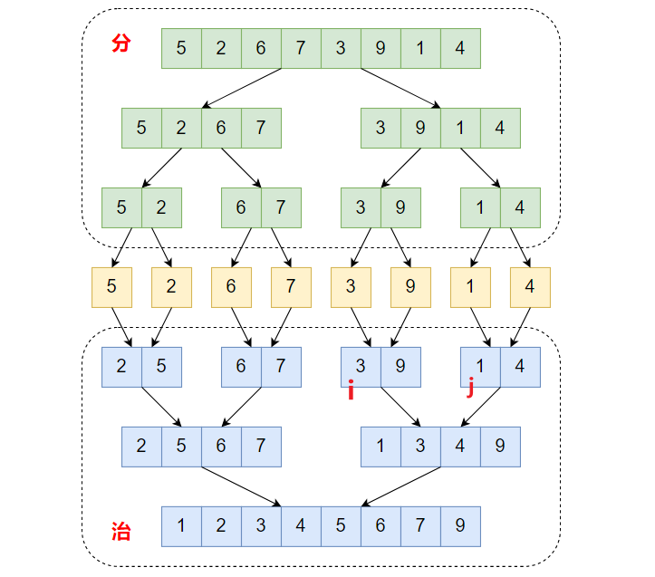
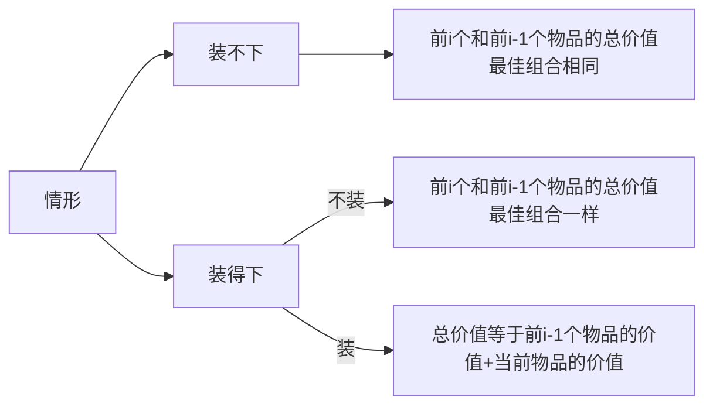
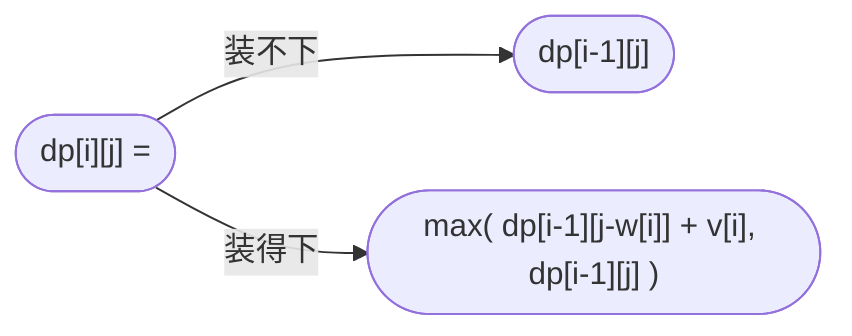
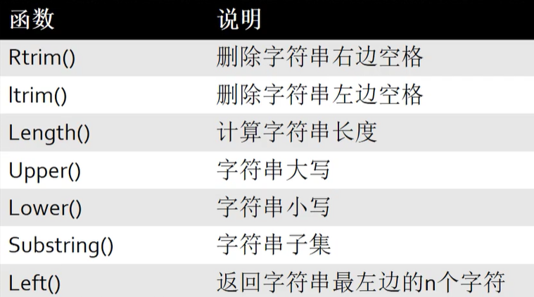
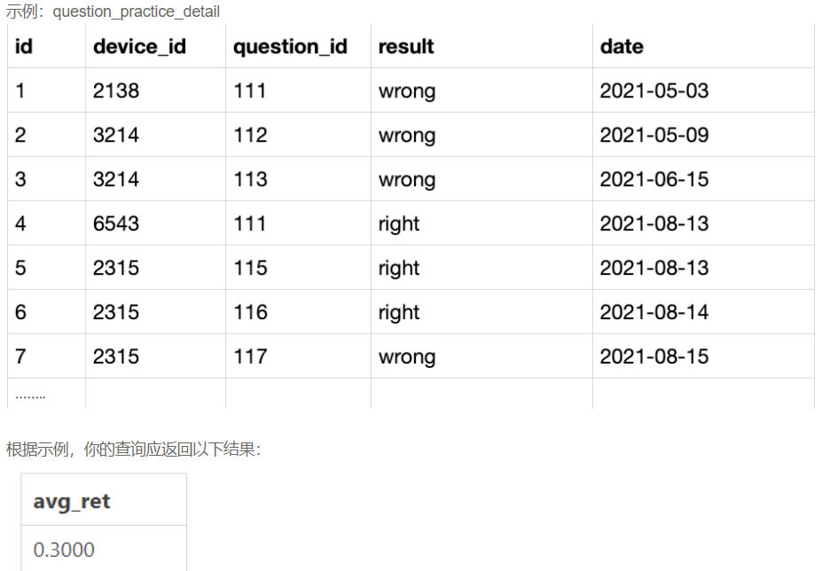

## 算法


### 查找

#### 二分查找

```python
def binsearch(arr, target):

    low, high = 0, len(arr)-1

    while low <= high:
        mid = (low + high) // 2
        if target == arr[mid]:
            return mid
        elif target > arr[mid]:
            low = mid + 1
        else:
            high = mid - 1
    return -1
```

### 排序

#### 冒泡

```python
"""
冒泡排序:每趟能确定一个元素的最终位置
"""
def bubble_sort(data):
    n = len(data)
    for i in range(n-1):
        for j in range(n-i-1):
            if data[j] > data[j+1]:
                data[j], data[j+1] = data[j+1], data[j]
    print(data)
```


#### 快排

```python
def quick_sort(arr):
    # 用栈保存区间左右边界，右边界先入栈
    stack = [len(arr)-1, 0]
    while stack:
        low, high = stack.pop(), stack.pop()
        p = partition(arr, low, high)
        # 基准元素的左区间存在则入栈
        if p > low:
            stack.append(p - 1)
            stack.append(low)
        # 基准元素的右区间存在则入栈
        if high > p:
            stack.append(high)
            stack.append(p + 1)
    return arr


def partition(arr, low, high):
    # 选取第一个元素作为基准元素
    p = arr[low]
    while low < high:
        # 比基准元素小的移到前面
        while low < high and arr[high] >= p:
            high -= 1
        arr[low] = arr[high]
        # 比基准元素大的移到后面
        while low < high and arr[low] <= p:
            low += 1
        arr[high] = arr[low]
    #     将基准元素放到最终的位置
    arr[low] = p
    return low
```


#### 选择

```python
"""
选择排序：每趟（i）从后面的n-i+1个待排元素选择1个最小的作为最终第i个元素的值
"""
def select_sort(arr):
    n = len(arr)
    for i in range(n-1):
        min = i
        for j in range(i+1, n):
            if arr[j] < arr[min]:
                min = j
        # 若第一个数字不是最小值，则交换位置
        if min != i:
            arr[i], arr[min] = arr[min], arr[i]

    return arr
```


#### 归并




==思路==：

1. 针对上图序列A（3,9）和序列B（1,4），指针i指向3，j指向1
2. 1 < 3，1添加到temp，同时指针j后移
3. 3 < 4，3添加到temp，同时指针i后移
4. 4 < 9，4添加到temp，同时指针j后移，此时j=8 > 右边界r=7,跳出循环
5. 此时i=5,j=8,mid=5,l=4,r=7，将剩下的序列A中的元素添加到temp列表中
6. 将temp中的所有元素赋给原序列arr对应位置

```python
def merge(arr, l, r, mid):
    temp = []
    i, j = l, mid + 1
    while i <= mid and j <= r:
        if arr[i] < arr[j]:
            temp.append(arr[i])
            i += 1
        else:
            temp.append(arr[j])
            j += 1
    print('-----------')
    print(f'i:{i}   j:{j}   mid:{mid}   l:{l}   r:{r}')
    
    # 此时其中一序列（如1,3,4）已经全部按顺序添加到temp中，另一序列还剩9,只需将剩下的添加到temp
    while i <= mid:
        temp.append(arr[i])
        i += 1
    while j <= r:
        temp.append(arr[j])
        j += 1
    print(temp)
    
    # 此时子序列已排好序，直接将temp中排好序的元素赋给arr对应位置
    arr[l: r + 1] = temp
    print(arr)


def merge_sort(arr, l, r):
    if l < r:
        mid = (l+r) // 2
        merge_sort(arr, l, mid)
        merge_sort(arr, mid+1, r)

        merge(arr, l, r, mid)
    return arr
```


#### 基础

##### 查找第一个不重复的字符

```python
def first_char(arr):
    d = {}
    
    """记录每个字符的出现次数"""
    for i, v in enumerate(arr):
        if v in d:
            d[v] += 1
        else:
            d[v] = 1
    print(d)
	
    """再次遍历返回次数为1的元素"""
    for i, v in enumerate(arr):
        if d[v] == 1:
            return v

print(first_char(['a', 'b', 'c', 'c', 'c', 'd', 'e', 'f', 'a']))
```


#### 动态规划

##### 01背包问题

从n个物品中选取一些物品（物品下标为i，背包容量为j），使得容量为s的背包包含的物品总价值最大。







```python
# 使用滚动数组优化：
# dp[j]表示容量为j的背包所装的最大价值
dp[j] = max(dp[j], dp[j-w[i]]+v[i])


def backpack():
    # 使用滚动数组dp[j]取代二维数组，表示容量为j的背包所装的最大价值
    w = [2, 3, 4, 6, 5]  # 重量
    v = [4, 5, 3, 3, 6]  # 价值
    s = 8  # 最大承受重量
    n = len(w)    # 物品个数
    dp = [0] * (s+1)
    obj_list = []

    dp1 = [[0]*(s+1) for i in range(n+1)]
    # 二维数组方法
    for i in range(1, n+1):
        for j in range(s+1):
            if j >= w[i-1]:
                dp1[i][j] = max(dp1[i-1][j], dp1[i-1][j-w[i-1]] + v[i-1])
            else:
                dp1[i][j] = dp1[i-1][j]
    print(dp1[-1])

    # 一维滚动数组
    for i in range(n):
        for j in range(s, w[i]-1, -1):		# 倒序遍历背包
            dp[j] = max(dp[j], dp[j-w[i]] + v[i])

    return dp


```


##### 礼物最大价值

> 在一个 m*n 的棋盘的每一格都放有一个礼物，每个礼物都有一定的价值（价值大于 0）。你可以从棋盘的左上角开始拿格子里的礼物，并每次向右或者向下移动一格、直到到达棋盘的右下角。给定一个棋盘及其上面的礼物的价值，请计算你最多能拿到多少价值的礼物？
>
> 链接：https://leetcode.cn/problems/li-wu-de-zui-da-jie-zhi-lcof


```python
def maxValue(grid: List[List[int]]) -> int:
    width = len(grid[0])
    height = len(grid)
    dp = [[0]*(width+1) for _ in range(height+1)]
	
    # 注意遍历顺序需要和i,j对应
    for i in range(1, height+1):
        for j in range(1, width+1):
            dp[i][j] = max(dp[i-1][j], dp[i][j-1]) + grid[i-1][j-1]

    return dp[height][width]

maxValue([[1,2,5],[3,2,1]])
```


#### 滑动窗口

> 给你一个整数数组 nums，有一个大小为 k 的滑动窗口从数组的最左侧移动到数组的最右侧。你只可以看到在滑动窗口内的 k 个数字。滑动窗口每次只向右移动一位。返回滑动窗口中的最大值 。
> 链接：https://leetcode.cn/problems/sliding-window-maximum
>
> 输入：nums = [1,3,-1,-3,5,3,6,7], k = 3
> 输出：[3,3,5,5,6,7]
> 解释：
> 滑动窗口的位置                最大值
>
> ---------------               -----
> [1  3  -1] -3  5  3  6  7       3
>  1 [3  -1  -3] 5  3  6  7       3
>  1  3 [-1  -3  5] 3  6  7       5
>  1  3  -1 [-3  5  3] 6  7       5
>  1  3  -1  -3 [5  3  6] 7       6
>  1  3  -1  -3  5 [3  6  7]      7


```python
def maxSlidingWindow(nums: List[int], k: int) -> List[int]:
    # 双端队列
    q = collections.deque
    res = []
    for i in range(len(nums)):
        # 单调递减栈
        while q and nums[i] >= nums[q[-1]]:
            q.pop()
        q.append(i)
        
        # # 当队头元素超出窗口边界时，弹出队头元素
        while q[0] <= i-k:
            q.popleft()
            
        # 从第二个窗口开始之后都要弹出队头元素，第一个窗口右边界k-1
        if i>=k-1:
            res.append(nums[q[0]])
    return res
```


#### 数组和树形数据转换
```python
data = [
    {'id': 1, 'pid': 0},
    {'id': 2, 'pid': 1},
    {'id': 7, 'pid': 2},
    {'id': 8, 'pid': 6}
]
```


- **扁平数组树形化**
  ```python
  def list2Tree(data, parent=None):
    output = []
    for node in data:
        if node["pid"] != parent:
            continue
        children = list2Tree(data, node["id"])
        node.update(children=children)
        output.append(node)
    return output
  ```


- **树形数据扁平化**
  ```python
  def flat_tree(data):
    ret = []
    for item in data:
        ret.append({"id": item["id"], "pid": item["pid"]})
        if item.get("children"):
            ret.extend(flat_tree(item["children"]))
    return ret
  ```


#### 最大数字组合
> 有几个任意位数的正整数，求能组成的最大数字

思路：  
若 a+b > b+a，则a应该在前，否则a在后

```python
from functools import cmp_to_key

def max_number(nums):
    # 自定义比较函数
    def compare(x, y):
        # 将两个字符串拼接起来进行比较
        return int(y + x) - int(x + y)

    # 将正整数转换为字符串
    nums = [str(num) for num in nums]

    # 使用自定义的比较函数对字符串进行排序
    nums.sort(key=cmp_to_key(compare))

    # 将排序后的字符串连接起来得到最大数
    result = ''.join(nums)

    return result

```


## MySQL

### 基础

```mysql
1 #DISTINCT返回唯一不同的值
SELECT DISTINCT 列名称 FROM 表名称

2#ORDER BY排序（DESC降序，ASC升序）
SELECT Company, OrderNumber FROM Orders ORDER BY Company DESC, OrderNumber ASC

3# IFNULL如果第一个参数 为 NULL，则返回第二个参数的备用值
IFNULL(
       (SELECT DISTINCT Salary
       FROM Employee
       ORDER BY Salary DESC 
       LIMIT 2 OFFSET 1),	#返回从第三行开始，共1行数据
       NULL)
    )
    
4 #join内连接，和inner join效果一样
SELECT a.NAME AS Employee
FROM Employee AS a JOIN Employee AS b
     ON a.ManagerId = b.Id
     AND a.Salary > b.Salary
     
5# Dense_RANK() over对成绩排名，RANK() over排名时若有并列将占用下一位的位置
select Score,Dense_RANK() over (order by Score desc) as `Rank`
from Scores
   
6 #顺序：where——group by——having，注意group by紧跟在where最后一个限制条件后面，不能被夹在where限制条件之间。使用了having必须使用group by，但是使用group by 不一定使用having

7 #IF(condition, value_if_true, value_if_false)

8#回购率：某一个时间窗口内消费的用户，在下一个时间窗口仍旧消费的占比
 #复购率：在某时间窗口内重复消费用户（消费两次及以上的用户）在总消费用户中占比


```




### 次日留存率


#查看用户在某天刷题后第二天还会再来刷题的平均概率。




```mysql
#先对用户去重，然后自连接，q1显示所有，q2显示留存
select 
    count(q2.device_id)/count(q1.device_id) as avg_ret
from 
    (select distinct device_id, date from question_practice_detail) q1
left join
    (select distinct device_id, date from question_practice_detail) q2
on q1.device_id=q2.device_id and q2.date=date_add(q1.date,interval 1 day)
```


