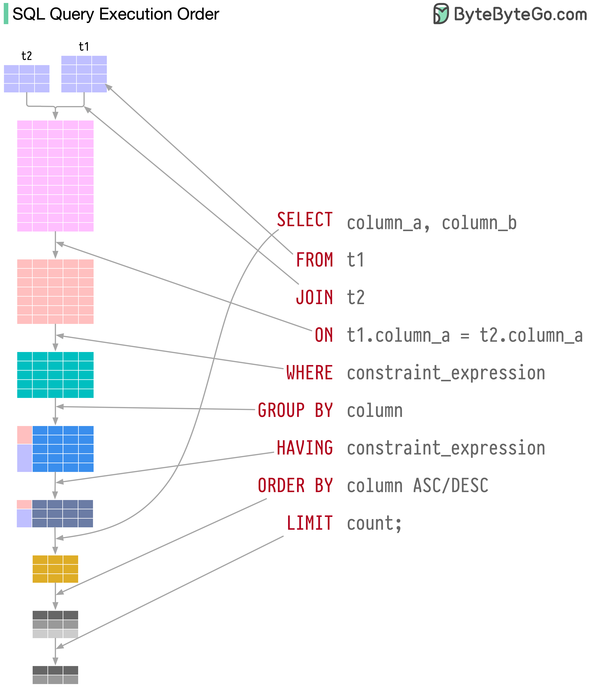

## 数据库设置

```sql
# 连接pgsql并创建数据库
psql -h localhost -U username -W -c "CREATE DATABASE game_community_admin"

# 连接某一个数据库
psql -h 172.16.6.41 -p 5432 -U postgres -d game_community_admin -W

# 查询当前数据库连接数，datname：数据库名称
SELECT count(*) FROM pg_stat_activity WHERE datname = 'game_community_admin';

# 释放当前数据库全部连接，才能删库
SELECT pg_terminate_backend(pid) FROM pg_stat_activity WHERE datname = 'game_community_admin' AND pid<>pg_backend_pid();


\l	# 查看所有库
\x	# 扩展显示
\c <database>		# 切换数据库
\q	# 退出sql命令行
\dt	# 查看此数据库下所有表
\d <tablename>	# 查看表结构
```


 ## 数据库设计规范
### 主键设计  
● 自增主键  
● uuid  
● ulid  
● 雪花算法  

**雪花算法由64bit数字组成**   

● 1-bit不用于生成ID(符号位)   
● 41-bit 当前时间戳(毫秒)-指定时间的差值，可以表示1 x 2^41 / (1000 x 3600 x 24 x 365) = 69年的时间  
● 10-bit 可以分别表示1 x 2^10 = 1024台机器节点, 范围[0,1023]；可以拆分为5位数据中心id + 5位工作节点id  
● 12-bit 表示1ms内自动递增的序列号，1 x 2^12 = 4096个 范围[0,4095]。单机1ms可以生成4096个不重复的ID  

**ulid和uuid的对比** 
| uuid         | ulid                                           |
| ------------ | ---------------------------------------------- |
| 128bit       | 128bit                                         |
| 36个字符     | 26个字符（前10个字符为时间戳，后16个为随机数） |
| 随机数（v4） | 按词典排序                                     |
|              | 无特殊字符（url安全）                          |
 


```sql
CREATE TABLE ROLE (
  -- GENERATED BY DEFAULT AS IDENTITY(START 20000000) 指定起始值
    id INT PRIMARY KEY GENERATED ALWAYS AS IDENTITY,
);


"id" serial PRIMARY KEY

```

### 索引

索引命名规范   

| uk_table_column            | 唯一索引     |
| ------------------------------ | ------------ |
| uc_table_col1_col2 | 联合唯一索引 |
| ix_table>_col1            | 普通单列索引 |
| ix_table_col1_col2 | 联合索引     |


**回表**  

假设有一个名为users的表，包含以下列：id（主键）、name、age  
创建了一个以"name"列为索引的非聚集索引，例如："CREATE INDEX idx_name ON users (name)"  
现在，执行一个查询语句：“SELECT name, age FROM users WHERE name = 'John'”。  
由于age不在索引中，查询时需要先查询出主键id，然后在主键id的索引树中找到age的数据。  

如何解决回表？  
● 聚集索引  
```sql
SELECT name, age FROM users WHERE id = 1;
```

● 覆盖索引 
```sql
# 创建覆盖索引
CREATE INDEX idx_name_age ON students (name, age);

# 查询语句，利用覆盖索引
SELECT name, age FROM users WHERE name = 'John';
``` 


### 逻辑删除
如何解决唯一性约束和is_delete冲突的问题？  
在存在唯一索引的表中添加一个delete_id字段，默认为-1，删除此条记录时，将is_delete设为true，同时delete_id设为当前行的主键id。  

假如要求username字段唯一，则设置username和delete_id为联合唯一索引


```python
class User(BaseModel):
    __tablename__ = 'user'
    username = db.Column(db.string(64), nullable=False, index=True)
    org_id = db.Column(db.SMALLINT, nullable=False, comment='组织id')
    delete_id = db.Column(db.INTEGER, nullable=False, default=0)

    __table_args__ = (
        db.UniqueConstraint('username', 'delete_id', name='_username_delete_id_uc'),
    )
```


### json和jsonb
区别：
* json写入快，读取慢  
* jsonb写入慢，读取快（jsonb以二进制形式存储已解析好的数据）  

JSONB 类型字段进行索引时，建议使用 GIN 索引。因为 GIN 索引适用于全文搜索和值匹配，可以更快地查询到符合条件的数据。而 BTree 索引只适用于比较操作和值匹配，对 JSONB 类型字段的查询效率可能会较低


### 多对多

*sqlalchemy语法*
```python 
user_roles = db.Table('sys_user_role',
    db.Column('id', db.Integer, primary_key=True),
    db.Column('user_id', db.Integer, nullable=False),
    db.Column('role_id', db.Integer, nullable=False)
)


@bp.post('/user_role')
@parser.use_args({
    'role_id': fields.Int(required=True),
    'user_id': fields.Int(required=True)
}, location='json')
@role_required()
def set_user_role(user, args):
    stmt = user_roles.insert().values(**args).returning(user_roles)
    ret = db.session.execute(stmt)
    ret = ret.mappings().one_or_none()
    db.session.commit()

    return response_success(data=dict(ret))

```

## 数据库操作
### 查询

**条件写在on和where的区别**  
对于inner join：结果无区别  
对于left outer join：返回左表全部数据，右表若不满足on中的条件，返回null  
right outer join同理  

**查询json字段类型中的某个属性**  
```sql
- 查询表arguments字段中的name属性
SELECT arguments->>'name' FROM table1;

- 查询arguments字段中的name属性，其中arguments值为数组嵌套字典格式，如[{}, {}]
select * from table1
where exists 
  (select 1 from jsonb_array_elements(arguments) as nested_data
   where nested_data->>'name' like '%原游戏%');
```

**深分页**  
查询的页数过大时会出现深分页问题，比如查询limit 10000 offset 20，则需要查出前100020条然后切片截取后20条。
解决办法：
```sql
SELECT title, content
FROM post a
JOIN 
  (SELECT id FROM post ORDER BY title LIMIT 10000, 20) b
ON a.id = b.id;
```


**判断区间是否重叠**  
```sql
SELECT * 
FROM fx_sharing_cp
WHERE daterange(start_dt, end_dt, '[]') && daterange('2023-12-21', '2023-12-22', '[]');


-- 为了保证高并发场景下数据不一致的问题，读和写最好用一条sql语句实现
WITH overlap_check AS (
  SELECT * 
  FROM fx_sharing_cp
  WHERE daterange(start_dt, end_dt, '[]') 
  && daterange('2023-12-21', '2023-12-22', '[]')
)
INSERT INTO fx_sharing_cp (org_id, game_id, pattern, start_dt, end_dt, create_by)
SELECT 1, 1, 1, '2023-12-21', '2023-12-22', 0
WHERE (SELECT COUNT(*) FROM overlap_check) = 0
```


**分组聚合**  
```sql
GROUPING SETS按不同维度汇总
SELECT
  tj_date,
  game_id,
  chl_id,
  plat,
  SUM(role_numb) AS role_numb,
  SUM(reg_numb)  AS reg_numb
FROM
  business_day
WHERE
  game_id = 2
GROUP BY
  GROUPING SETS (
    (tj_date, game_id),
    (tj_date, game_id, chl_id),
    (tj_date, game_id, chl_id, plat)
  )

```


### 更新

>插入性能从低到高依次为：
>executemany < execute_batch < prepare+execute_batch < execute_values
>
>更新性能从低到高依次为：
>executemany < execute_values < execute_batch < prepare+execute_batch
>
>删除性能从低到高依次为：
>executemany < execute_batch < execute_values < prepare+execute_batch 
>
>作者：xiangrumei https://www.bilibili.com/read/cv26399649/ 出处：bilibili


#### 批量更新
使用临时表的方式：  
```python
# 更新历史分配记录

UPDATE_POST_SCORE = """
    UPDATE post_community SET score = tmp.score
    FROM (VALUES (%s, %s)) AS tmp(id, score)
    WHERE post_community.post_id=tmp.id;
"""

from psycopg2.extras import execute_batch
execute_batch(cursor, UPDATE_POST_SCORE, result)

```

如果数据量大，不能一次将数据全部加载进内存，使用 itersize或 fetchmany分批次读取，前提是使用命名游标`named cursor` 

> stackoverflow命名游标的使用分析  
> 注意：使用命名游标情况下，如果使用fetchmany，即使设置了itersize，itersize也不会生效

```python
cursor = self.conn.connection.cursor(name="named_cursor")
cursor.itersize = 5000
cursor.execute(SELECT_POST_COUNTS)
data = cursor.fetchmany(20000)

now = DT.now_time()
while data:
    result = map(lambda x: (
        x[0],
        (x[1] + 2 * x[2] + 3 * x[3]) / (6 * ((round((now - x[-1].replace(tzinfo=now.tzinfo)).total_seconds() / 3600 + 2)) ** 1.8))
    ), data)
    execute_batch(self.cursor, UPDATE_POST_SCORE, result)
    data = cursor.fetchmany(20000)
```


### 删除
```sql
- 清空表数据并重置主键id
TRUNCATE TABLE post_community RESTART IDENTITY;
```


### 分区
分区模式：  
● range	基于连续范围分区  
● list  基于离散值分区  


```sql
-- 让rtime分区

CREATE TABLE IF NOT EXISTS "event_log" (
	event VARCHAR(50),
	rtime INT NOT NULL DEFAULT EXTRACT(EPOCH FROM CURRENT_TIMESTAMP)::INT,
	distinct_id VARCHAR NOT NULL,
	user_id INT DEFAULT -1,
	args json
) PARTITION BY range (rtime);

-- 不属于任何分区的数据将会插入到默认表中
CREATE TABLE event_log_default PARTITION OF event_log DEFAULT;

```

创建分区表不建议使用触发器（会降低性能），因此使用脚本定时任务创建，比如当月25号创建下个月的分区表，具体创建逻辑据业务而定。
```python
from dateutil.relativedelta import relativedelta


def part_table_by_month(sub_table):

    """按月分区表"""
    now = DT.cur_dt()
    next = now + relativedelta(months=1)  # 下一个月
    next_next = next + relativedelta(months=1)  # 下下个月

    part_name = f"{sub_table}_{next.year}{next.month:02d}"
    start = DT.str2ts(f"{next.year}-{next.month}-01", "%Y-%m-%d")
    end = DT.str2ts(f"{next_next.year}-{next_next.month}-01", "%Y-%m-%d") - 1
    try:
        part_ret = part_table(sub_table, start, end)
        logger.info(f"创建分区表成功: {part_ret}")
    except Exception as e:
        logger.critical(f"创建分区表失败: {part_name}, 失败原因：{str(e)}")


def part_table(sub_table: str, start, end) -> str:
    """
    按月创建分区表（当月触发，创建下个月的）
    :param end: 分区结束范围
    :param start: 分区起始范围
    :param sub_table: 主表名
    :return: 分区表名
    """

    sql_command = f"""CREATE TABLE IF NOT EXISTS {sub_table} PARTITION OF {sub_table} FOR VALUES FROM (:start) TO (:end);"""
    try:
        db.session.execute(text(sql_command), {"start": start, "end": end})
        db.session.commit()
        return sub_table
    except Exception as e:
        db.session.rollback()
        raise e
```


### 窗口函数

|  |               |
| ------------ | --------------------- |
| row_number() | 依次编号 |
| rank()       | 跳过并列编号：1 1 1 4 |
| dense_rank() | 不跳过并列行：1 1 1 2 |

	


## 数据库备份

```bash
# 备份数据库，排除`community_log`和 `users`表，仅导出数据不包括结构
pg_dump -h <host> -p <port> -U <user> -d <database> -F p --data-only -T community_log -T users > /data/backup.sql

# 导出某张表
pg_dump -h host -p port -U username -s -t tablename dbname > struct.sql

# 目标数据库上执行sql脚本
psql -h <host> -p <port> -U <user> -d <database> -W -f /data/backup.sql
```
