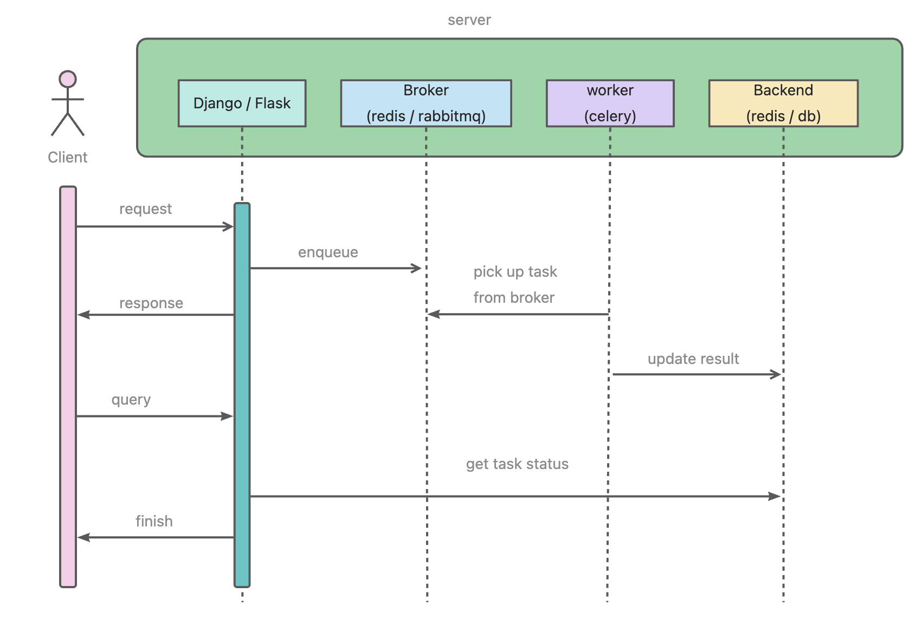
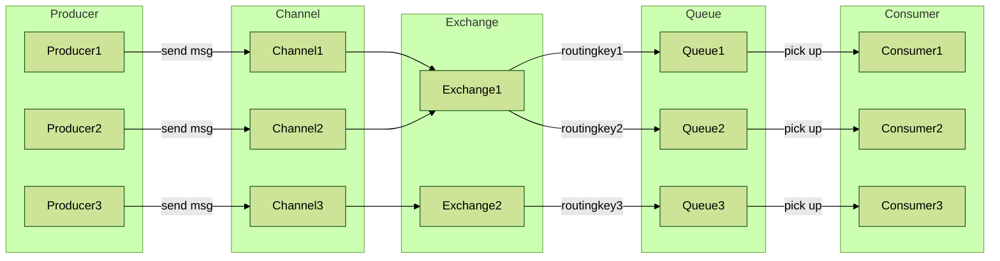

## 问题1：job无法被worker正确接收
线上同一台机器部署了两套服务，分别启动了Celery应用，选取Rabbitmq作为Broker，其中两套服务共用同一个Broker。结果导致：服务B的任务被服务A的Celery received，于是可能会报错：  
*Received unregistered task of type 'apps.tasks.scheduled_job.calc_post_score'*


### 消息队列

首先了解一下`AMQP`的几个核心定义：  
> AMQP，即Advanced Message Queuing Protocol（高级消息队列协议）  
> 参考：[celery文档](https://docs.celeryq.dev/en/latest/userguide/routing.html#exchanges-queues-and-routing-keys)

* message 消息，由headers和body组成，例如celery中消息格式：
  ```python
    {
     'task': 'myapp.tasks.add',
     'id': '54086c5e-6193-4575-8308-dbab76798756',
     'args': [4, 4],
     'kwargs': {}
     }
    ```
  
* producer 生产者，发送信息的客户端通常称为发布者或生产者
* consumer 消费者，接收消息的实体
* broker 消息中间件，负责将信息从生产者路由到消费者，可以是redis或rabbitmq（官方推荐）
* channel 信道，建立在connection连接之上
* exchanges 交换机，负责接收生产者发送的消息，并将其路由到相应的队列。支持3种类型：`Direct`、`Topic`、`Fanout`，[不是所有传输都支持这3种](https://docs.celeryq.dev/projects/kombu/en/main/introduction.html#transport-comparison)

* queues 队列，存储消息的地方，消费者会从队列中获取消息
* routing keys 路由键，exchange会根据路由键将消息路由到对应的队列


**任务发送接收流程**



**AMQP通信流程**



### 解决方案
问题1原因：  
exchange无法将job路由到对应的队列，或者说因为没有指定队列，导致队列中的job共享而无法找到。  
解决方法就是初始化时指定队列名。  
以下展示了Flask中如何配置队列和交换机

通过工厂函数初始化celery app，配置了queue之后，任务函数也必须指定一个队列名，或者设置一个`task_default_queue`默认队列，就不用在每个任务函数装饰器中使用 `queue` 参数指定队列了
```python
    
# 配置queues
celery.conf.task_queues = (
    Queue(
        "game_community_default",
        Exchange("game_community_default"),
        routing_key="game_community_default",
    ),
)
celery.conf.task_default_queue = "game_community_default"
celery.set_default()
celery.autodiscover_tasks(["apps.tasks"])
```


### 使用celery的注意点

`task_acks_late`  
设置为True表示任务在执行完成之后才确认，如果Worker进程突然退出或被kill掉也会立即确认；如果为False表示执行之前就确认（默认值）

`task_reject_on_worker_lost`  
设为False, worker进程崩掉之后将重新加入worker，默认值False，可能会造成循环执行

`task_always_eager` 设为True可用于本地同步调试，而不经过broker


**周期任务无法被正确识别？**  
使用`include`指定任务模块（和import语义相同）  
使用`beat_schedule`参数指定周期任务字典配置，比如：
```python
"""手动导入任务，否则可能无法识别"""
INCLUDES = "apps.tasks.scheduled_job"

BEAT_SCHEDULES = {
    # 更新文章热度值
    "calc_post_score": {
        "task": "apps.tasks.scheduled_job.calc_post_score",
        "schedule": crontab("0", "1,7,13,19"),
        "args": (),
    },
    # 更新评论热度值
    "calc_comment_score": {
        "task": "apps.tasks.scheduled_job.calc_comment_score",
        "schedule": crontab("30", "1,7,13,19"),
        "args": (),
    },
}
```

**celery如何访问Flask App上下文**

```python
def init_app(app: Flask, config) -> Celery:
    class FlaskTask(Task):
        def __call__(self, *args: object, **kwargs: object) -> object:
            with app.app_context():
                return self.run(*args, **kwargs)

    celery = Celery(app.name, task_cls=FlaskTask)
    celery.task_cls = FlaskTask
    celery.config_from_object(config)
    
      
    # 配置queues
    celery.conf.task_queues = (
        Queue(
            "game_community_default",
            Exchange("game_community_default"),
            routing_key="game_community_default",
        ),
    )
    celery.conf.task_default_queue = "game_community_default"
    celery.set_default()
    celery.autodiscover_tasks(["apps.tasks"])

    app.extensions["celery"] = celery
    return celery
```

另外，使用 @celery_app.task 来装饰任务函数需要访问 celery_app 对象，而使用工厂模式则无法访问 celery_app对象，用@shared_task来替代。  
  
调用 celery_app.set_default() 使得@shared_task 装饰器可以访问任何current app，这与 Flask 的蓝图和应用程序上下文概念类似。

**Task states**
状态      | 说明                 |
| ------- | ------------------ |
| PENDING | 任务已被添加到任务队列中，等待执行 |
| STARTED | 任务已开始执行            |
| RETRY   | 任务已失败并且正在尝试重新执行    |
| FAILURE | 任务执行失败             |
| SUCCESS | 任务执行成功             |
| REVOKED | 任务已被撤销             |

自定义状态
```python
@app.task(bind=True)
def upload_files(self, filenames):
    for i, file in enumerate(filenames):
        if not self.request.called_directly:
            self.update_state(state='PROGRESS',
                meta={'current': i, 'total': len(filenames)})
```


## 问题2：Apscheduler周期任务重复执行
多进程环境下，比如Gunicorn多个worker部署，Apscheduler周期任务会重复执行多次

这是Apscheduler3的一个issue，不知道后续版本会不会优化

### 解决方案
* 尝试过设置gunicorn worker数=1，无法解决  
* redis分布式锁，执行之前尝试获取锁，成功才执行，注意最后无论执行是否成功都要释放锁


## 如何设计一个Scheduled Job
**cron表达式**
|属性    |  英文名  |    值    |
| -------- | ------------- | ----------------- |
|分        | minute        | 0-59              |
| 时        | hour          | 0-23              |
| 日        | day_of_month  | 1-31              |
| 月        | month_of_year | 1-12              |
| 周        | day_of_week   | 0-6 |
| 开始时间（可选） | start_time    |                   |
| 截止时间（可选） | end_time


**周期任务表 periodic_task**


|column             | type     | description             |
| ----------------------- | ------------ | --------------------------- |
| name                    | str          | 任务名                         |
| description             | str          | 备注                          |
| args                    | json / jsonb | 任务函数参数                        |
| last_run_time           | datetime     | 最后一次运行时间                    |
| trigger | str          | contab触发参数                  |
| status                  | int   | 执行状态                          |
| enabled                 | int          | 任务启用 / 关闭                   |
| job_id                  | str    | 任务唯一id |
| result                  | str / json   | 执行结果          |
| log_path                | str          | 日志路径