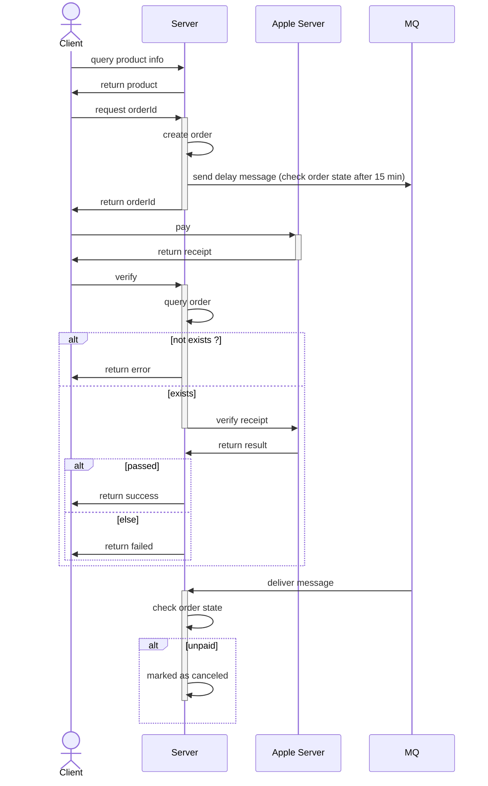

**验证项：**  
针对旧版验证api：https://developer.apple.com/documentation/appstorereceipts/verifyreceipt
为了验证收据伪造等情况，需验证以下几点：
1. receipt.environment，区分订单环境（生产或沙盒），若返回21007表示沙盒环境，此时需用沙盒api再次验证https://sandbox.itunes.apple.com/verifyReceipt，方便客户端在生产环境进行测试而不用来回切换环境
2. receipt.status == 0，为0表示有效
3. order.product_id in product，系统中商品是否存在
4. receipt.product_id == order.product_id，收据返回的商品id是否和订单的商品id一致
5. receipt.bundle_id == product.bundle_id，不同bundle_id之间的product_id可能重复，若有多个包，系统可单独管理内购商品，此时订单中的product_id应该为product表的主键id
6. receipt.transaction_id，检查商户id是否已存在于订单记录中，若存在表示已验签，可将 (pay_type, transaction_id) 作为联合唯一索引
7. receipt.cancellation_date，如果receipt中包含cancellation_date属性，说明交易被取消或退款
8. order.ctime < receipt.purchase_date_ms，正常情况应该是下单时间小于收据中的购买时间，前提是系统时间order.ctime准确无误  

**流程图：**  

