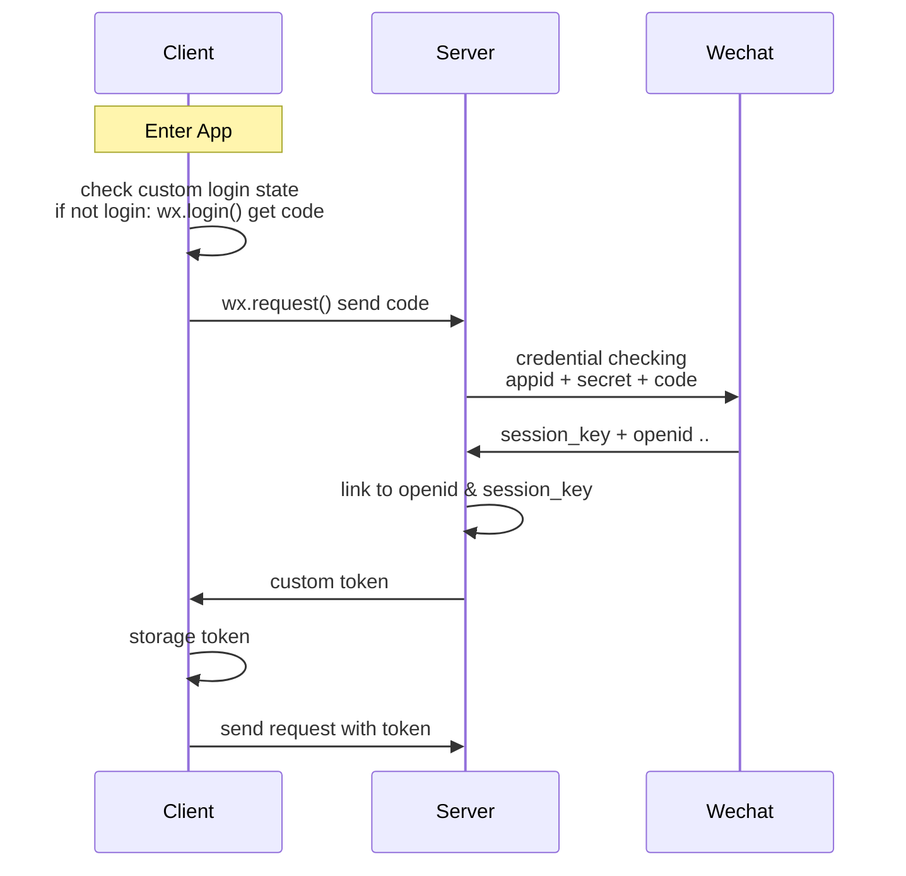

```mermaid
sequenceDiagram
     Note over Client: Enter App 
    Client ->> Client:  check custom login state <br> if not login:  wx.login() get code
    Client ->> Server: wx.request() send code
    Server ->> Wechat: credential checking <br> appid + secret + code
    Wechat ->> Server: session_key + openid ..
 
    Server ->> Server: link to openid & session_key
    Server ->> Client: custom token
    Client ->> Client: storage token
    Client ->> Server: send request with token
```