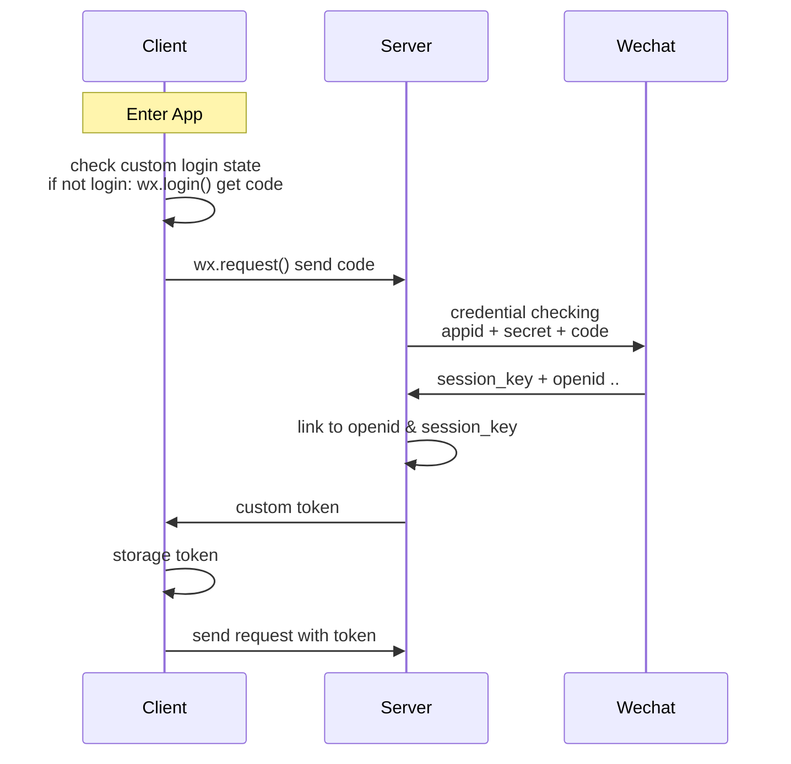
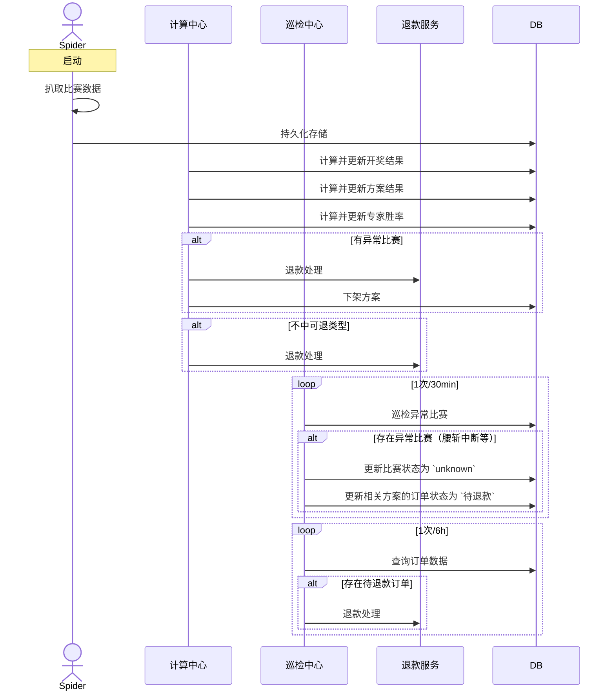

```mermaid
sequenceDiagram
     Note over Client: Enter App 
    Client ->> Client:  check custom login state <br> if not login:  wx.login() get code
    Client ->> Server: wx.request() send code
    Server ->> Wechat: credential checking <br> appid + secret + code
    Wechat ->> Server: session_key + openid ..
 
    Server ->> Server: link to openid & session_key
    Server ->> Client: custom token
    Client ->> Client: storage token
    Client ->> Server: send request with token
```

```mermaid
sequenceDiagram
    actor Spider
    participant 计算中心
    participant 巡检中心
    participant 退款服务
    participant DB
    
    Note over Spider: 启动
    Spider->>Spider: 扒取比赛数据
    Spider->>DB: 持久化存储
    
    计算中心->>DB: 计算并更新开奖结果
    计算中心->>DB: 计算并更新方案结果
    计算中心->>DB: 计算并更新专家胜率
    alt 有异常比赛
        计算中心->>退款服务: 退款处理
        计算中心->>DB: 下架方案
    end
    alt 不中可退类型
        计算中心->>退款服务: 退款处理
    end
    
    loop 1次/30min
        巡检中心->>DB: 巡检异常比赛
        alt 存在异常比赛（腰斩中断等）
            巡检中心->>DB: 更新比赛状态为 `unknown`
            巡检中心->>DB: 更新相关方案的订单状态为 `待退款`
        end
    end
    
    loop 1次/6h
        巡检中心->>DB: 查询订单数据
        alt 存在待退款订单
            巡检中心->>退款服务: 退款处理
        end
    end
```